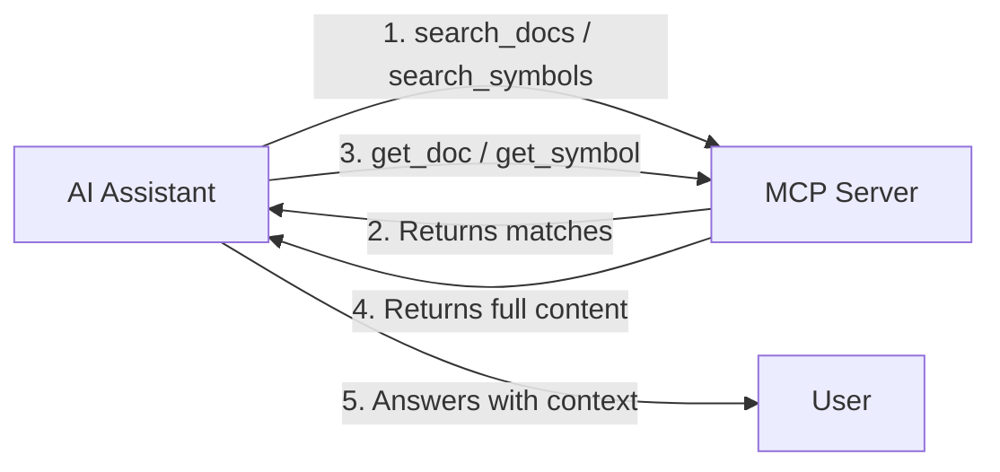
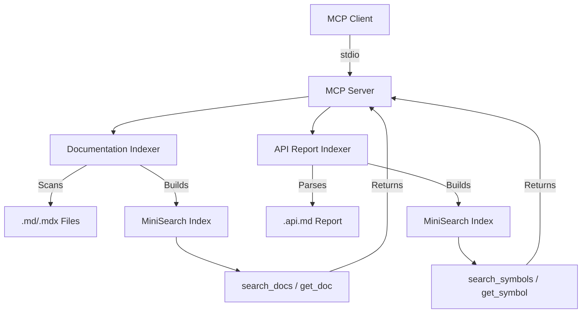

# ng-diagram MCP Server

> **MCP server that enables AI assistants to search ng-diagram documentation and public API**

An [MCP (Model Context Protocol)](https://modelcontextprotocol.io) server that provides intelligent documentation search and API symbol lookup for the ng-diagram library. Connect it to AI assistants like Claude, Cursor, or any MCP-compatible tool to get instant access to ng-diagram documentation and API reference.

## What is This?

This server allows AI assistants to search through ng-diagram's documentation and public API symbols. Instead of manually browsing docs, you can ask your AI assistant questions like:

- "How do I create custom nodes in ng-diagram?"
- "Show me examples of node rotation"
- "What's the signature of the `DiagramComponent` class?"
- "Which interfaces does ng-diagram export?"

The AI will search the documentation and API reference, then provide you with relevant answers.

## How It Works


```mermaid
graph LR
    A[AI Assistant] -->|1. search_docs / search_symbols| B[MCP Server]
    B -->|2. Returns matches| A
    A -->|3. get_doc / get_symbol| B
    B -->|4. Returns full content| A
    A -->|5. Answers with context| D[User]
```

**Flow:**

1. AI searches documentation sections or API symbols
2. Server returns matching results with titles, paths, and URLs
3. AI retrieves full page content or full symbol details
4. Server returns the complete documentation body or symbol signature
5. AI uses the content to provide detailed, accurate answers

## Current Usage (Internal)

**Who can use it now:** ng-diagram maintainers and contributors

This server is currently configured to run locally for the ng-diagram development team. It indexes the documentation from the monorepo and the public API report, providing search capabilities during development.

### Setup for Development

1. **Install dependencies:**

   ```bash
   cd tools/mcp-server
   pnpm install
   ```

2. **Build the server:**

   ```bash
   pnpm build
   ```

3. **Configure your MCP client** (e.g., Claude Desktop, Cursor, Kiro):

   Add to your MCP configuration file:

   ```json
   {
     "mcpServers": {
       "ng-diagram-docs": {
         "command": "node",
         "args": ["/absolute/path/to/ng-diagram/tools/mcp-server/dist/index.js"],
         "cwd": "/absolute/path/to/ng-diagram"
       }
     }
   }
   ```

4. **Restart your AI assistant** to load the server

5. **Test it:** Ask your AI assistant to search ng-diagram documentation!

## Future Vision (Public Release)

### For Library Consumers

In the future, ng-diagram users will be able to install and use this MCP server without cloning the repository:

```bash
# Future: Install via npm
npm install -g @ng-diagram/mcp-server

# Or use with npx
npx @ng-diagram/mcp-server
```

Then configure it in your AI assistant to get instant documentation access while building your Angular diagrams.

## API Reference

### Tool: `search_docs`

Search through ng-diagram documentation sections. Returns full section content split by `##` headings. Supports exact phrases, multi-word queries, and individual keywords.

**Parameters:**

- `query` (string, required): Search query to find relevant documentation
- `limit` (number, optional): Max results to return (default: 10)

**Response:**

```typescript
{
  results: Array<{
    pageTitle: string;      // Title of the parent page
    sectionTitle: string;   // Title of the matched section
    content: string;        // Full markdown content of the section
    description?: string;   // Document description (first section only)
    path: string;           // Relative file path (use with get_doc)
    url: string;            // Full documentation URL with anchor
  }>;
}
```

### Tool: `get_doc`

Retrieve the full content of a documentation page by its path. Returns the complete markdown body with frontmatter stripped.

**Parameters:**

- `path` (string, required): Relative path from docs root (e.g., `"guides/palette.mdx"`). Use paths from `search_docs` results.

**Response:**

```typescript
{
  title: string;   // Document title
  body: string;    // Full markdown body (frontmatter stripped)
  url: string;     // Base page URL
}
```

### Tool: `search_symbols`

Search through ng-diagram public API symbols (classes, functions, interfaces, types, constants, enums). Powered by [MiniSearch](https://lucaong.github.io/minisearch/) indexing of the API Extractor report.

**Parameters:**

- `query` (string, required): Search query (e.g., `"Diagram"`, `"provideNg"`, `"Edge"`)
- `kind` (string, optional): Filter by symbol kind (`class`, `function`, `interface`, `type`, `const`, `enum`)
- `limit` (number, optional): Max results to return (default: 10)

**Response:**

```typescript
{
  results: Array<{
    name: string;        // Symbol name
    kind: string;        // Symbol kind
    signature: string;   // Symbol signature
    importPath: string;  // Import path
  }>;
}
```

### Tool: `get_symbol`

Retrieve full API details for a specific ng-diagram symbol by exact name. Returns kind, full signature, jsDoc (if available), and a ready-to-use import statement.

**Parameters:**

- `name` (string, required): Exact symbol name (case-sensitive). Use names from `search_symbols` results.

**Response:**

```typescript
{
  name: string;              // Symbol name
  kind: string;              // Symbol kind
  signature: string;         // Full type signature
  jsDoc?: string;            // JSDoc documentation (if available)
  importStatement: string;   // Ready-to-use import statement
}
```

## Development

### Project Structure

```
tools/mcp-server/
├── src/
│   ├── services/              # Core business logic
│   │   ├── indexer.ts         # Documentation indexing
│   │   ├── search.ts          # Documentation search (MiniSearch)
│   │   ├── api-indexer.ts     # API Extractor report indexing
│   │   └── symbol-search.ts   # API symbol search (MiniSearch)
│   ├── tools/                 # MCP tool implementations
│   │   ├── search-docs/       # search_docs tool
│   │   ├── get-doc/           # get_doc tool
│   │   ├── search-symbols/    # search_symbols tool
│   │   └── get-symbol/        # get_symbol tool
│   ├── types/                 # TypeScript definitions
│   ├── server.ts              # MCP server
│   └── index.ts               # Entry point
├── tests/                     # Test files
└── dist/                      # Build output
```

### Commands

```bash
# Development
pnpm dev              # Run with auto-reload

# Testing
pnpm test             # Run all tests
pnpm test:watch       # Run in watch mode

# Building
pnpm build            # Compile TypeScript
```

### Architecture


```mermaid
graph TD
    A[MCP Client] -->|stdio| B[MCP Server]
    B --> C[Documentation Indexer]
    B --> D[API Report Indexer]
    C -->|Scans| E[.md/.mdx Files]
    C -->|Builds| F[MiniSearch Index]
    D -->|Parses| G[.api.md Report]
    D -->|Builds| H[MiniSearch Index]
    F --> I[search_docs / get_doc]
    H --> J[search_symbols / get_symbol]
    I -->|Returns| B
    J -->|Returns| B
```

**Components:**

- **MCP Server**: Handles protocol communication via stdio
- **Documentation Indexer**: Scans `.md`/`.mdx` files, extracts frontmatter and section content
- **API Report Indexer**: Parses API Extractor `.api.md` report, extracts symbol signatures
- **Search Engines**: MiniSearch-powered full-text search for both docs and API symbols
- **Tool Handlers**: Validate input, format output per tool schema

## Contributing

This is part of the ng-diagram monorepo. Contributions are welcome!

1. Make changes in `tools/mcp-server/`
2. Run tests: `pnpm test`
3. Build: `pnpm build`
4. Test with your AI assistant

## License

Initial PoC by [Pawel Kubiak](https://pawelkubiak.dev/about)

Apache-2.0 - Part of the [ng-diagram](https://github.com/synergycodes/ng-diagram) project

---

**Built with ❤️ by the Synergy Codes team**
