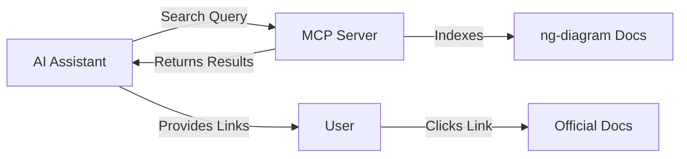

# ng-diagram MCP Server

> **MCP server that enables AI assistants to search ng-diagram documentation**

An [MCP (Model Context Protocol)](https://modelcontextprotocol.io) server that provides intelligent documentation search for the ng-diagram library. Connect it to AI assistants like Claude, Cursor, or any MCP-compatible tool to get instant access to ng-diagram documentation.

## What is This?

This server allows AI assistants to search through ng-diagram's documentation and return relevant results with direct links. Instead of manually browsing docs, you can ask your AI assistant questions like:

- "How do I create custom nodes in ng-diagram?"
- "Show me examples of node rotation"
- "How does the palette component work?"

The AI will search the documentation and provide you with relevant pages and direct links.

## How It Works



**Flow:**

1. AI assistant sends a search query to the MCP server
2. Server searches indexed ng-diagram documentation
3. Returns relevant results with titles, descriptions, and URLs
4. AI provides you with clickable links to official documentation

## Current Usage (Internal)

**Who can use it now:** ng-diagram maintainers and contributors

This server is currently configured to run locally for the ng-diagram development team. It indexes the documentation from the monorepo and provides search capabilities during development.

### Setup for Development

1. **Install dependencies:**

   ```bash
   cd tools/mcp-server
   pnpm install
   ```

2. **Build the server:**

   ```bash
   pnpm build
   ```

3. **Configure your MCP client** (e.g., Claude Desktop, Cursor, Kiro):

   Add to your MCP configuration file:

   ```json
   {
     "mcpServers": {
       "ng-diagram-docs": {
         "command": "node",
         "args": ["/absolute/path/to/ng-diagram/tools/mcp-server/dist/index.js"],
         "cwd": "/absolute/path/to/ng-diagram"
       }
     }
   }
   ```

4. **Restart your AI assistant** to load the server

5. **Test it:** Ask your AI assistant to search ng-diagram documentation!

## Future Vision (Public Release)

### For Library Consumers

In the future, ng-diagram users will be able to install and use this MCP server without cloning the repository:

```bash
# Future: Install via npm
npm install -g @ng-diagram/mcp-server

# Or use with npx
npx @ng-diagram/mcp-server
```

Then configure it in your AI assistant to get instant documentation access while building your Angular diagrams.

## Roadmap

### Phase 1: MVP (Current) ✅

- [x] Basic documentation search
- [x] Multi-word query support
- [x] Full URL generation to official docs
- [x] Integration with MCP-compatible tools

### Phase 2: Enhanced Search

- [ ] Synonym support (e.g., "setup" → "installation")
- [ ] Better ranking with TF-IDF
- [ ] Search analytics to improve results
- [ ] Fuzzy matching for typos

### Phase 3: Public Distribution

- [ ] Publish to npm as standalone package
- [ ] Configuration options for custom doc sites
- [ ] Support for multiple documentation versions
- [ ] HTTP transport option (in addition to stdio)

### Phase 4: Advanced Features

- [ ] Semantic search with embeddings (RAG)
- [ ] Code example extraction
- [ ] Interactive API explorer
- [ ] Integration with GitHub Copilot

## API Reference

### Tool: `search_docs`

Search through ng-diagram documentation.

**Parameters:**

- `query` (string, required): Search query
- `limit` (number, optional): Max results to return (default: 10)

**Response:**

```typescript
{
  results: Array<{
    title: string; // Document title
    description?: string; // Document description
    excerpt: string; // Relevant text snippet
    url: string; // Full URL to documentation
  }>;
}
```

**Example:**

```json
{
  "query": "custom nodes",
  "limit": 3
}
```

Returns:

```json
{
  "results": [
    {
      "title": "Custom Nodes",
      "description": "How to create and implement custom nodes in ngDiagram",
      "excerpt": "...create custom node components with any Angular template...",
      "url": "https://www.ngdiagram.dev/docs/guides/nodes/custom-nodes"
    }
  ]
}
```

## Development

### Project Structure

```
tools/mcp-server/
├── src/
│   ├── services/          # Core business logic
│   │   ├── indexer.ts     # Documentation indexing
│   │   └── search.ts      # Search engine
│   ├── tools/             # MCP tool implementations
│   │   └── search-docs/   # Search tool handler
│   ├── types/             # TypeScript definitions
│   ├── server.ts          # MCP server
│   └── index.ts           # Entry point
├── tests/                 # Test files
└── dist/                  # Build output
```

### Commands

```bash
# Development
pnpm dev              # Run with auto-reload

# Testing
pnpm test             # Run all tests
pnpm test:coverage    # Run with coverage

# Building
pnpm build            # Compile TypeScript
```

### Architecture


**Components:**

- **MCP Server**: Handles protocol communication via stdio
- **Documentation Indexer**: Scans `.md`/`.mdx` files, extracts metadata
- **Search Engine**: Multi-tier matching (exact phrase → multi-word → single word)
- **Tool Handler**: Validates input, formats output

## Contributing

This is part of the ng-diagram monorepo. Contributions are welcome!

1. Make changes in `tools/mcp-server/`
2. Run tests: `pnpm test`
3. Build: `pnpm build`
4. Test with your AI assistant

## License

PoC implemented by [Pawel Kubiak](https://pawelkubiak.dev/about)

MIT - Part of the [ng-diagram](https://github.com/synergycodes/ng-diagram) project

---

**Built with ❤️ by the Synergy Codes team**
